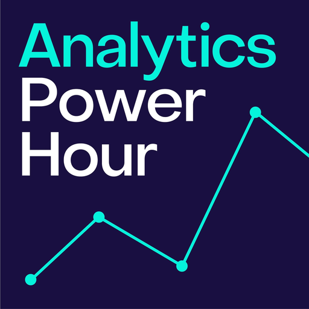

# Analytics Power Hour Librarian

Ask what the Analytics Power Hour hosts and guests have said about any analytics topic, and get answers built from quoted transcript snippets. Each quote is cited with the episode number, title, timestamp, and a link to the episode page. The Librarian also answers questions about the archive itself, such as which episode is the latest or which episodes came out in a given year.

## What's included

- **The `aph-librarian` skill:** how to search the transcripts, quote them, and cite each episode.
- **The Analytics Power Hour MCP server** at `https://mcp.analyticshour.io/mcp`, with two read-only tools:
  - `search_transcripts` finds quotable passages about a topic, optionally within one episode.
  - `list_episodes` lists episodes newest first, with the archive's total and its latest episode, and can filter by year or title.

## Try asking

- What have the hosts said about building a data-driven culture?
- What's the latest Analytics Power Hour episode about?
- Find the episodes where they talk about AI agents, and quote the best bits.
- What did they cover in episode 300?

## What it sends

The plugin runs no code on your computer. When Claude or ChatGPT uses a tool, it sends your search text, plus any episode number, year, or title filter, to `https://mcp.analyticshour.io/mcp`. Michael Helbling, a co-host of the Analytics Power Hour, runs that server on Cloudflare for the show. No account or sign-in is needed, and nothing else from your conversation is sent. The server keeps standard request logs (IP address, time, and request path) for up to 7 days, for reliability and to prevent abuse. See the [privacy policy](https://mcp.analyticshour.io/privacy).

## More

- [Documentation](https://mcp.analyticshour.io/docs): setup for Claude, ChatGPT, and other MCP clients, plus the tools' parameters
- [Terms of use](https://mcp.analyticshour.io/terms)
- [Support](https://mcp.analyticshour.io/support), or email [contact@analyticshour.io](mailto:contact@analyticshour.io)

Copyright © 2026 Analytics Power Hour. All rights reserved. See [LICENSE](LICENSE).
